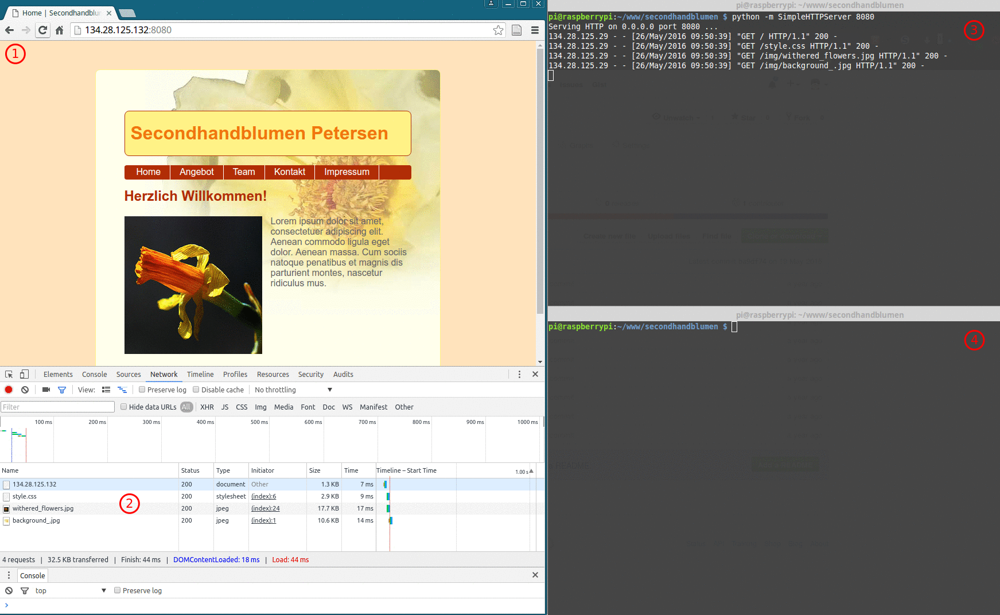
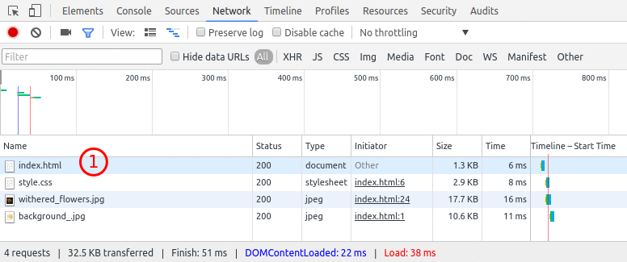
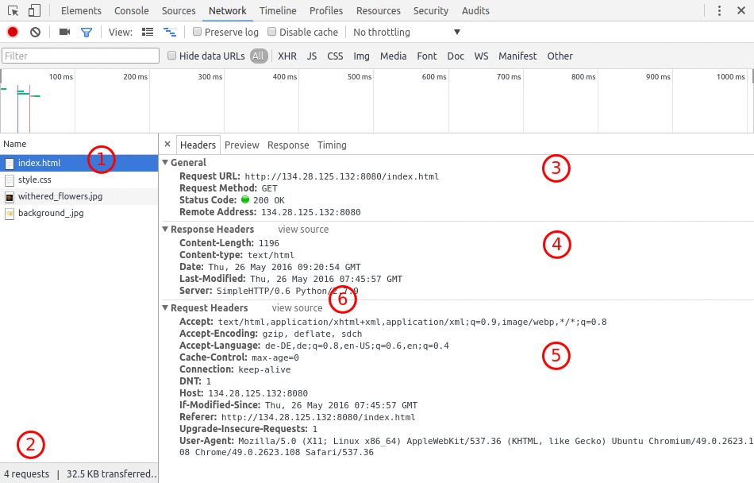

# Analyse der Kommunikation zwischen Client und Server

Im folgenden Beispiel wird beschrieben, wie man die Kommunikation zwischen dem Browser auf dem Clientrechner und der Webserversoftware sichtbar machen und analysieren kann.

## Voraussetzungen

- Nutzung von Google Chrome oder Chromium in einer aktuellen Version (im Beispiel Version 49.0.2623.108 Built on Ubuntu 14.04, running on LinuxMint 17.3 (64-bit))
- Server mit Python und dem Modul `SimpleHTTPServer` (im Beispiel Raspberry Pi mit Raspian Debian Jessie)
- Hosting einer mittelkomplexen Website auf dem Server (im Beispiel die Seite *Secondhandblumen Petersen*, frei verfügbar unter https://github.com/xldrkp/secondhandblumen)

## Ablauf des Experiments

Das Experiment wird von Bob und Alice durchgeführt.

Mit einer Anwendung wie PuTTY oder dem Terminal verbindet sich Alice per SSH mit dem Server (vgl. Abb. 1, (3)). Dort navigiert sie in den Ordner, der die Website hostet und startet den Server.

Im Browser ruft Bob nun die Adresse auf, unter der die Website zu erreichen ist. Sofern er erfolgreich ist, schaltet er die *Entwicklertools* dazu, erreichbar über das Burgermenü des Chrome-Browsers oder die Tastenkombination `STRG+SHIFT+I` oder die Funktionstaste `F12`. Standardmäßig wird die Ansicht der Entwicklertools unten angezeigt (vgl. Abb. 1, (2)).

Bob wechselt anschließend in den Tab "Netzwerk" und ruft mit `F5` erneut die Website im Browser auf. In der Folge können Bob und Alice den Netzwerkverkehr zwischen Client und Server beobachten (vgl. (2) und (3)). Der Server schreibt sein Logfile direkt ins Terminal und zeigt damit an, welche Befehle er über HTTP empfängt. Die Statuscodes zeigen an, wie er die Anfrage (Request) behandelt und ob er dem anfragenden Client eine Antwort (Response) geben kann.

Das Navigieren in der Website zeitigt weiteren Netzwerkverkehr.

## Erweiterung des Experiments

Alice schlägt vor, sich den *Server Roundtrip* genauer anzusehen. Bob fragt, was sie damit meint. Alice erklärt: Der Server Roundtrip wird auch *Request-Response-Cycle* genannt. Beides bedeutet im Grunde dasselbe, nämlich dass der Client eine Anfrage an den Server stellt und dieser eine Antwort gibt - Request, Response. Dieser Trip wird oftmals wiederholt, weil nicht nur die HTML-Seite vom Server geholt werden muss, sondern auch alle Resourcen, die darin eingebunden sind, also Bilder, CSS, JavaScript und andere Daten. Die Entwicklertools des Browsers geben genaueren Einblick in die Kommunikation, wenn man eine Resource anklickt.

Bob navigiert auf die Homepage, aktualisiert die Browseransicht und klickt anschließend auf `index.html` im Netzwerktab (vgl. Abb. 2, (1)).

Die folgende Ansicht zeigt die Daten, die bei Request und Response jeweils am Kopfende der HTTP-Kommunikation mitgeschickt wurden. Sie werden daher auch im Tab *Headers* angezeigt. Im Bereich (1) kann die Datei ausgewählt werden, die vom Server abgerufen werden soll. Für die Seite `index.html` werden insgesamt vier Requests gestellt, wie (2) zeigt. Bereich (3) zeigt generelle Informationen zu der Anfrage. (4) zeigt Informationen zur Antwort des Servers, (5) listet Daten auf, die mit dem Request zum Server geschickt wurden. Hinter *view source* (6) verbirgt sich ein Umschalter, der die Daten nochmal in Rohform anzeigt.

Klicks auf andere Dateien in (1) bringen andere Informationen in (3-6) hervor.

## Fragen und Aufgaben

* Welche HTTP-Statuscodes gibt es? Tragen Sie bitte unter diesem Aufzählungspunkt einige einschlägige Quellen zusammen!
* Füllen Sie das Formular Ihrer Website aus. Schicken Sie es ab. Was passiert? Finden Sie heraus, wie Sie in den Entwicklertools die übertragenen Formulardaten auf dem Weg zum Server sehen können!
