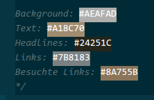

# Atom

## Packages

Packages erweitern die Funktionalität von Atom in unterschiedlichsten Bereichen. Im folgenden sind die Packages aufgeführt, die im Kontext der Veranstaltung besprochen und konfiguriert wurden.

Den Bereich zur **Installation** von Packages wird geöffnet über `Edit -> Preferences -> Install`.

Den Bereich zur **Konfiguration** von Packages wird geöffnet über `Edit -> Preferences -> Packages`.

### Autosave

**Quelle:** Core Package

**Zweck:** Speichert die geöffnete Datei automatisch

**Konfiguration:** Es gibt eine sinnvolle Funktion von autosave, die per Default deaktiviert ist: Sie speichert automatisch den Stand der aktiven Datei in Atom, wenn das Fenster verlassen wird. So spart man sich das manuelle Speichern, wenn man bei der Webentwicklung in den Browser umschaltet.

**Zugang:** Eingeschaltet wird diese Funktion über `Settings -> Packages -> autosave -> Settings -> Enabled (nach unten scrollen)`

### Pigments

**Quelle:** https://atom.io/packages/pigments

**Zweck:** Legt Farben auf Farbangaben im CSS

**Konfiguration:** Nach der Installation funktioniert das Package wie gewünscht.
